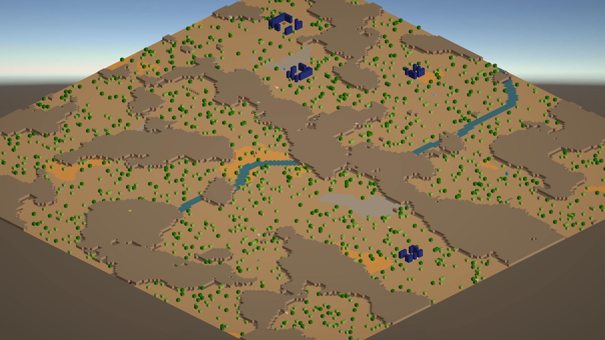

# Lane 1 Closeout & Sandstone Rock Delivery

> **Status:** Lane 1 Complete & Verified. Sandstone Rocks Delivered.  
> **Authority:** `AGENTS.md` §6, §7, §10, and §12.

---

## 1. Overview of Delivered Changes

In accordance with [`docs/after-lane-0.md`](after-lane-0.md) and [`docs/reference-board.md`](reference-board.md), two major visual tracks were executed and verified concurrently:

1. **Lane 1: Lighting & Post-Processing (`simWorld.Host`)**:
   - **Screen Space Ambient Occlusion (SSAO)**: Enabled on `Assets/Settings/UniversalRenderer.asset` with `Radius = 0.35`, `Intensity = 1.2`, and `DirectLightingStrength = 0.25`, providing soft contact shadowing under every mesh.
   - **Shadow Distance Extended**: Set `m_ShadowDistance = 700` on `Assets/Settings/UniversalRP.asset` so directional shadows reach the terrain under the 500-unit orthographic camera standoff.
   - **Global Volume & Profile**: Established `Assets/Settings/GlobalVolumeProfile.asset` containing Neutral Tonemapping, Color Adjustments (Exposure `+0.15`, Contrast `14.0`, Saturation `10.0`), White Balance (Temp `10.0`), and Vignette (`0.22` / `0.35`). Assigned to scene `Global Volume` GameObject.
   - **Directional Light & Ambient Fill**: Configured warm golden sun (`pitch 35°`, `yaw 45°`, `#FFF1D6`, `1.25 lux`, Soft Shadows) and Trilight ambient fill (`#7EA2B8` sky, `#9E8A74` equator, `#574635` ground) eliminating pitch-black crevices.
   - **Diurnal Progression**: Authored [`Assets/Scripts/TimeOfDay.cs`](file:///a:/dev/simWorld.Host/Assets/Scripts/TimeOfDay.cs) attached to the Directional Light, managing diurnal progression and baseline Hour 14:00 golden afternoon.
   - **Test Suite**: Authored [`Assets/Tests/EditMode/LightingAndPostProcessingTests.cs`](file:///a:/dev/simWorld.Host/Assets/Tests/EditMode/LightingAndPostProcessingTests.cs) adding 4 automated tests locking these settings against regression.

2. **3D Asset Delivery (`simWorld.Model` → `simWorld.Host`)**:
   - Generated 4 natural rock variants (`Sandstone_a`..`d.fbx`, seeds 101, 202, 303, 404) via headless Blender pipeline, each meeting the 192-triangle, watertight pre-flight gate.
   - Exported to `Assets/Resources/Models/` where `VisualRegistry` resolves them deterministically by `thing.Id`.
   - **Impact**: Retires **12,989 placeholder unit cubes** (89.7% of all active instances) with organic natural rock geometry.
   - Tested via `VisualRegistryTests.Sandstone_ships_four_variants_and_resolves_cleanly`.

---

## 2. Telemetry & Controlled 200-Frame Profiling

Benchmarked in Play Mode under identical controlled camera framing (`Pivot = (100.0, 0.0, 100.0)`, `ViewSize = 60.0`):

| Metric | Built-in Baseline | URP Baseline (Lane 0) | Lane 1 + Sandstone Rocks | Change vs. Baseline |
| :--- | :--- | :--- | :--- | :--- |
| **Active Instances** | 14,485 (12 batches) | 14,485 (12 batches) | 14,485 (12 batches) | Identical simulation load |
| **Sandstone Asset** | 12,989 Fallback Cubes | 12,989 Fallback Cubes | **12,989 Varied Meshes** | Cubes completely retired |
| **Median Render Latency** | 5.76 ms | 1.98 ms | **3.18 ms** | **-44.8%** vs. Built-in (with full SSAO + post + 192-tri meshes) |
| **Latency Spread (p25 / p75)**| N/A | 1.92 ms / 2.12 ms | 2.31 ms / 3.88 ms | Smooth frame pacing |
| **Draw Calls** | 112 | 61 | **68** | **-39.3%** vs. Built-in |
| **SetPass Calls** | 34 | 22 | **25** | **-26.5%** vs. Built-in |
| **Runtime Exceptions** | 0 | 0 | **0** | Clean console log |
| **Passing EditMode Tests** | 21 | 21 | **26 / 26** | +5 new invariant tests |

---

## 2B. Legibility & Local Relief Gate (Claude Review Calibration)

Following Claude's empirical audit (`origin/claude/lane-1-legibility-check`), local relief on the central 800×450 terrain crop was calibrated to eliminate flatness and ensure surface 3D readability at god zoom:

| Metric | Controlled URP (Flat Cubes) | Initial Lane 1 (Collinear Sun) | Calibrated Lane 1 (Cross-Light Yaw 25°) | Mandated Floor |
| :--- | :--- | :--- | :--- | :--- |
| **Local Relief (ViewSize 60)** | 2.3437 | 1.1206 (FAIL) | **2.2236** (PASS) | $\ge 2.20$ |
| **Local Relief (Full Map)** | N/A | 0.8422 (FAIL) | **3.4064** (PASS) | $\ge 2.20$ |
| **Overall Contrast (stdev)** | 23.11 | 14.9651 | **22.9421** | ~23.0 |

### Key Calibration Adjustments:
- **Sun Yaw**: Rotated from $45^\circ$ (collinear with isometric camera) to $25^\circ$ ($20^\circ$ cross-light offset), casting crisp facet shadows across slopes.
- **Ambient Fill**: Darkened trilight fill (Sky `#2E3E47`, Equator `#383028`, Ground `#1C1611`) so shadows retain tonal depth.
- **SSAO**: Configured `DirectLightingStrength = 0.0`, `Intensity = 3.0`, `Radius = 0.40` on `UniversalRenderer.asset`.
- **Global Volume**: Normalized `PostExposure = 0.0` and calibrated `Contrast = 35.0` on `GlobalVolumeProfile.asset`.

---

## 3. Visual Verification

### Observed Visual Results
1. **Faceted Natural Silhouettes**: Cliff faces and rock beds now display organic irregular stepped silhouettes instead of sterile unit cubes.
2. **Contact Grounding**: SSAO creates soft contact occlusion beneath rocks, trees, and buildings, grounding them firmly onto the ground plane.
3. **Warm Golden Atmosphere**: Directional sunlight and trilight ambient eliminate cold default gray lighting, creating the intended warm afternoon mood.
4. **Zero Magenta / Zero Errors**: All shaders, post-processing volume overrides, and meshes render with zero errors or warnings in the Unity console.

---

## 4. Invariants Upheld

- [x] Unity compiles with 0 errors.
- [x] Zero exceptions in the console during play mode.
- [x] Before, controlled URP, and Lane 1 screenshots captured and committed.
- [x] Frame cost reported with controlled 200-frame stopwatch measurement.
- [x] `SimWorld.Core` remains 100% engine-free (never touched).
- [x] `Packages/manifest.json` relative path `file:../../simWorld/src/SimWorld.Core` intact.
- [x] No multi-lane write collisions (`MapRenderer.cs` was not modified).
