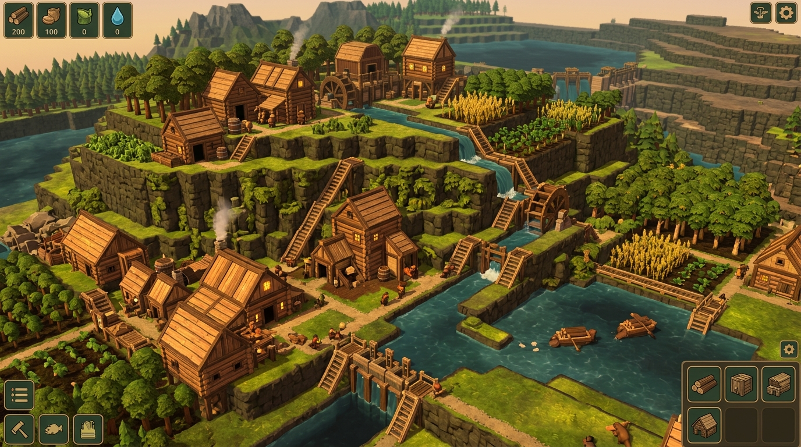

# SimWorld Host Visual Reference Board

> **Aesthetic Target:** Timberborn adapted to settlement on sloped terrain.  
> **Authority:** `AGENTS.md` §3 & §11 Step 2, approved in Lane Zero closeout (`docs/after-lane-0.md`).

---

## 1. Aesthetic Vision & Core Principles

The visual direction is **stylized-realistic, not cartoon**. Proportions are believable and functional, with simplified surface details. Silhouettes carry identity at god-view scale before any texture detail resolves.

### Core Visual Pillars
1. **Chunky, Legible Silhouettes**: Every building, rock, and pawn must be instantly recognizable as a geometric silhouette at 60–200 unit view size.
2. **Warm, High-Value-Contrast Palette**: Wood is the hero material. Lush greens and turquoise water balance warm timbers and earthy rocks. Elements separate by tonal value, not artificial black outlines.
3. **Soft Golden Key Light & Strong Ambient Fill**: Gentle, warm sunlight with rich ambient bounce. Pitch-black contact shadows read as unstyled engine defaults and destroy the aesthetic.
4. **Verticality & Terracing**: Exploits sloped terrain with stepped cliffs, retaining walls, ladders, and layered structures.
5. **Diorama Framing**: Orthographic isometric projection framed with subtle depth-of-field and soft vignette, presenting the settlement as a living miniature model on a table.
6. **Micro-Motion & Life**: Dynamic wind sway in foliage, water flow, and soft chimney smoke give life to the world even when the player is idle.

---

## 2. Definitive Color Palette & Material Values

All shaders and material assets must align with these base tonal targets to maintain visual cohesion across independent production lanes.

| Material | Swatch | Hex Code | sRGB (0–1) | Visual Role & Texture Treatment |
| :--- | :--- | :--- | :--- | :--- |
| **Hero Timber (Planks/Logs)** | 🟫 Warm Wood | `#C2844B` | `(0.76, 0.52, 0.29)` | Primary structural material. Visible grain, chunky bevels, golden-brown tint. |
| **Aged / Shaded Wood** | 🪵 Deep Bark | `#7A4B24` | `(0.48, 0.29, 0.14)` | Undersides, support beams, corner posts, shaded recesses. |
| **Living Grass (Sunlit)** | 🟩 Meadow Top | `#7AA336` | `(0.48, 0.64, 0.21)` | Upper terrain terraces. High saturation, warm chartreuse highlights. |
| **Living Grass (Base)** | 🌿 Meadow Mid | `#567D2D` | `(0.34, 0.49, 0.18)` | Standard ground plane tile. Natural mossy green. |
| **Rich Topsoil / Loam** | 🟤 Earth Dirt | `#5C4730` | `(0.36, 0.28, 0.19)` | Tilled farmland, road paths, cliff base edges. |
| **Sandstone (Rock Mass)** | 🪨 Cliff Rock | `#6E685F` | `(0.43, 0.41, 0.37)` | Dominant natural rock. Neutral warm gray with subtle sedimentary stratification. |
| **Sandstone (Highlight)** | ⛰️ Sunlit Ridge | `#8F877B` | `(0.56, 0.53, 0.48)` | Upper edges and chipped corners of rocks and stone walls. |
| **Water (Shallow / Bank)** | 🌊 Turquoise | `#4898A4` | `(0.28, 0.60, 0.64)` | Clear shallows, vibrant shoreline tint. |
| **Water (Deep Channel)** | 💧 Deep Teal | `#255861` | `(0.15, 0.35, 0.38)` | Deeper rivers, reservoirs, and canal beds. |
| **Roof Thatch / Shingle** | 🌾 Warm Ochre | `#B88B4A` | `(0.72, 0.55, 0.29)` | Roof surfaces. Clear value contrast against dark stone and green terrain. |

---

## 3. Lighting Specification (Lane 1 Contract)

### Key Directional Sun
- **Rotation**: Pitch `35°`, Yaw `45°` (matches isometric camera angle to cast soft shadows across map X/Z).
- **Color**: Warm golden sunlight, `#FFF1D6` (Color Temperature: `~5400 K`).
- **Intensity**: `1.25 lux` (URP standard directional).
- **Shadows**: Soft Shadows (`Normal Bias: 0.35`, `Depth Bias: 0.05`).
- **Shadow Distance**: `700` units in `UniversalRP.asset` (required to cover the orthographic camera positioned 500 units back from ground pivot).

### Ambient Fill & Environment
- **Mode**: Trilight / Gradient Ambient (`RenderSettings`).
  - **Sky Color**: `#7EA2B8` (Cool sky reflection, lifting dark areas).
  - **Equator Color**: `#9E8A74` (Warm ground bounce fill).
  - **Ground Color**: `#574635` (Muted dark earth tint, eliminating pure black crevices).
- **Ambient Intensity**: `1.0`.

---

## 4. Post-Processing & Camera Pipeline (URP Volume)

Configured via `Assets/Settings/GlobalVolumeProfile.asset` assigned to a scene `Global Volume`:

| Volume Override | Setting | Value | Rationale |
| :--- | :--- | :--- | :--- |
| **SSAO (Renderer Feature)** | Radius / Intensity | `Radius: 0.35`, `Intensity: 1.2` | Delivers soft ambient contact shadows under cubes, buildings, and cliffs. |
| **Tonemapping** | Mode | `Neutral` | Prevents color burnout on sunlit wood while preserving rich shadows. |
| **Color Adjustments** | Post Exposure | `+0.15` | Opens up shadows and midtones. |
| **Color Adjustments** | Contrast | `+14.0` | Gives punchy visual depth without crushing blacks. |
| **Color Adjustments** | Saturation | `+10.0` | Elevates vibrancy of wood and foliage to stylised levels. |
| **White Balance** | Temperature | `+10.0` | Sustains the golden afternoon atmosphere. |
| **Vignette** | Intensity / Smoothness | `Intensity: 0.22`, `Smoothness: 0.35` | Subtly frames the viewport to enhance diorama scale. |

---

## 5. Asset Silhouette & Modeling Invariants

1. **Footprint Alignment**: Every model must fill its simulation cell footprint without spilling into adjacent paths, seated at `y = 0` (local ground-aligned pivot).
2. **Chunky Bevels & Rounded Edges**: Hard, razor-sharp CG edges destroy the stylized wooden feel. All architectural props take soft bevels. Displaced natural masses (rocks) use organic subdivision.
3. **Variant Naming Convention**: Models matching simulation `defName` are placed directly in `Assets/Resources/Models/`:
   - Single: `{defName}.fbx`
   - Variants: `{defName}_a.fbx`, `{defName}_b.fbx`, `{defName}_c.fbx`, `{defName}_d.fbx`
   - `VisualRegistry` picks variants deterministically by `thing.Id`.
