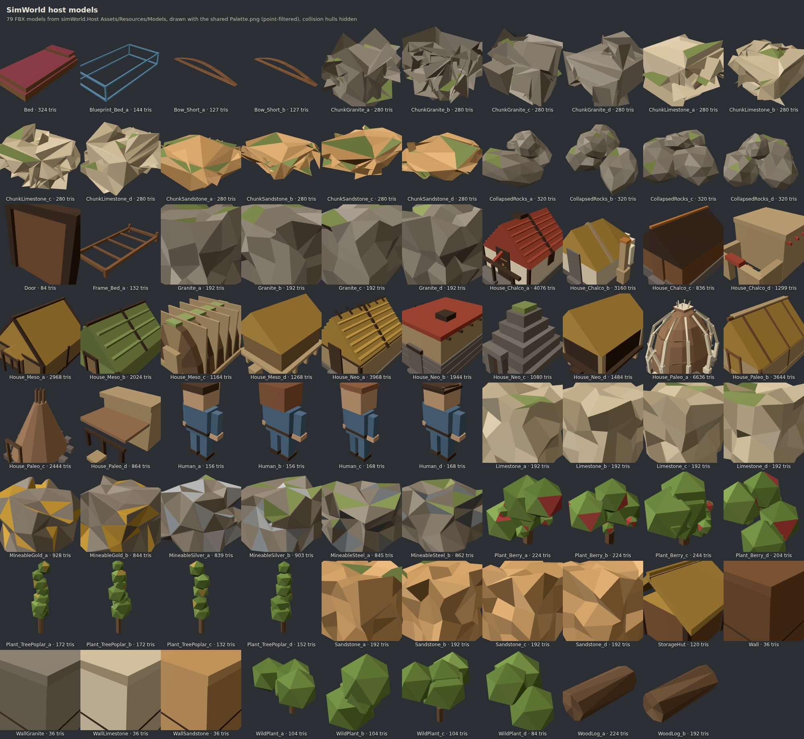
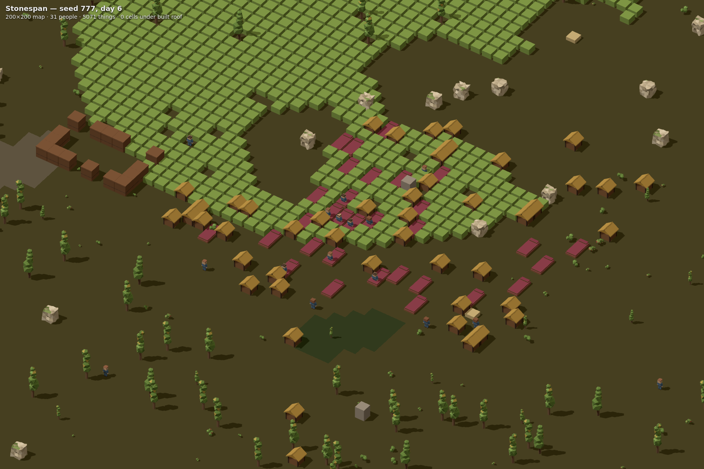
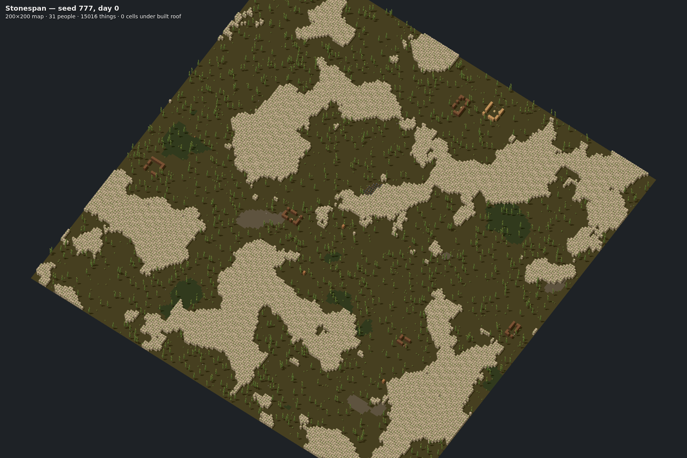
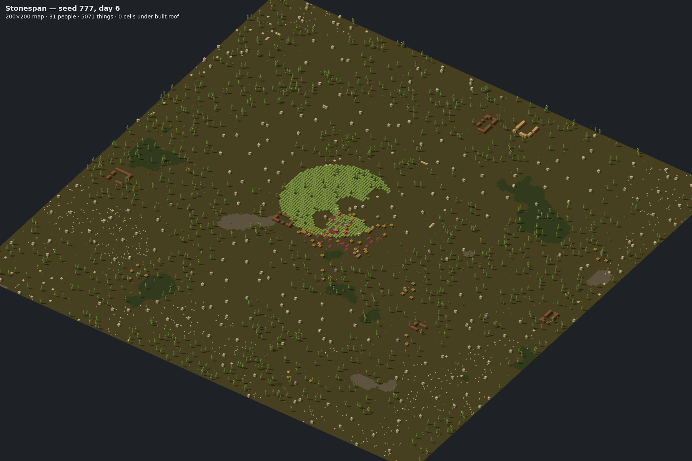

# Review: the models in the game view

**From:** the core (`simWorld`)
**To:** the host
**Status:** Open
**Date:** 2026-10-08
**Reviews:** `main` at `8e9b636` (models regenerated through the palette, 10-06 and 10-07)

The 79 models look good, and the two-register look reads clearly. Four things stand
between them and the player: one is in the meshes and three are in `MapRenderer`.

The renders below were not taken in Unity. A three.js harness drew them from
`Resources/Models/*.fbx` with `Palette.png`, placing each model the way it was
authored: base on the ground, 1 unit = 1 cell, turned by the core's `Rotation`. They
show what the game view should look like, which is the comparison each ask needs.
The map is a real core map (seed 777, populated world, `TribalStart`), taken from
`MapViewSnapshot` at day 0 and day 6.

| | |
| :--- | :--- |
|  |  |
| All 79 models, palette applied | Seed 777, the settlement at day 6 |
|  |  |
| Seed 777, day 0 | Seed 777, day 6 (the mountains are a core bug, see the end) |

## 1. `MapRenderer` places models with the placeholder box transform

`MapRenderer.cs` lines 309 to 313 build every instance as
`TRS((OccupiedMin + size/2, height/2, …), identity, (sx, HeightFor(t), sz))`.
That was right for a unit cube centred on its origin. The models are authored
differently (measured from the FBX):

| Model | x | y | z |
| :--- | :--- | :--- | :--- |
| `Wall`, `Granite_a` | −0.50 to 0.50 | 0 to 1.00 | −0.50 to 0.50 |
| `Bed` | −0.45 to 0.45 | 0 to 0.33 | −0.90 to 0.90 |
| `Plant_TreePoplar_a` | −0.34 to 0.30 | 0 to 2.76 | −0.32 to 0.34 |
| `Human_a` | −0.25 to 0.25 | 0 to 0.87 | −0.12 to 0.14 |

So in the game view:

- **Everything floats.** A wall or a rock sits half a cell above the ground, because
  the model's base is already at y = 0 and the transform lifts it by `height / 2`.
- **Plants are squashed.** `HeightFor` scales a mature poplar to 1.0 instead of its
  2.76, and a seedling to 0.25.
- **Nothing turns.** `Bed` is 1×2 at four facings on the core's `main`
  (simWorld#88). An east-facing bed arrives with `OccupiedSize` 2×1, so the model,
  0.9 × 1.8 along z, is stretched to 1.8 × 1.8. Doors have the same problem.

**Ask.** For a thing that resolves to a model:

- Place it at `(OccupiedMin.x + sx/2, 0, OccupiedMin.z + sz/2)`.
- Rotate it by `Rotation` (Rot4 → −90° × `AsInt` about Y).
- Scale it uniformly by 1. If growth should show, scale plants uniformly by growth.
- Keep `HeightFor` and the non-uniform box only for `VisualRegistry.FallbackMesh`.

## 2. The palette does not reach the game view

`NOW.md` says colour now travels inside the mesh, and that this closes the lanes 2
and 3 review. It does on the imported prefab, where the postprocessor assigns
`M_Palette`. But `MapRenderer` never draws the prefab. It takes the mesh out of it
(`MeshFor`) and draws it with `MaterialFor`'s per-batch material: a `StylizedLit`
material whose `_BaseColor` is `StableColor(defName)`, with no texture. Every model
in play is therefore one flat hashed colour, and the UVs into `Palette.png` are
never sampled.

**Ask.** Draw model batches with `M_Palette` (instancing enabled). The fallback cube
can keep `DefColors`. **Evidence owed:** one game-view screenshot of a populated map
(`unity command screenshot --view game`), so we can both see it.

## 3. Terrain is still coloured by hash

`RebuildTerrain` (line 204) colours terrain with `StableColor(defName)`, although
`Resources/Palette/palette.json` now carries a `terrain` table (`Soil` →
`terrain_soil`, `WaterShallow` → `water_shallow` and so on). The renders above use
that table.

**Ask.** Decode terrain through `palette.json`'s `terrain` table, with `DefColors` as
the fallback for a defName the table does not name.

## 4. The twelve chunk meshes are partly inside out

Counting triangles whose winding faces toward the model's centre:

| Model | Faces wound inward |
| :--- | ---: |
| `ChunkGranite_a` to `_d` | 38%, **62%**, 40%, 38% |
| `ChunkLimestone_a` to `_d` | 35%, 38%, 35%, 36% |
| `ChunkSandstone_a` to `_d` | 35%, 34%, 36%, 39% |
| `Granite`, `Limestone`, `Sandstone`, `Mineable*`, `CollapsedRocks` | 0% to 5% |

This is why the chunks look crumpled in the gallery. It points at the decimation
pass from the REQ-002 worklist (item 2).

**Ask.** Fix it in `simWorld.Model`'s chunk generator: recalculate normals to the
outside after decimating, then regenerate. Add a winding check to
`tools/validate_blender.py` so the next decimation cannot reintroduce it.

## What a real run asks for that has no model yet

From seed 777 at day 6, by count:

| Thing | Count |
| :--- | ---: |
| `Plant_Rice` | 943 |
| `Pemmican` | 281 |
| `RawBerries` | 46 |
| `Sculpture` | 12 |
| `Steel` | 3 |
| `ResearchBench` | 2 |
| `Meat_Generic` | 2 |
| `Leather_Plain` | 2 |
| `Corpse_Muffalo` | 2 |
| `Blueprint_FueledStove` | 1 |
| Animals (`Muffalo`, `Chicken`, `Husky`) | 6 |

`Plant_Rice` is the field the whole settlement grows. It is the biggest single gap
on screen.

## Not the renderer's doing (core bugs visible in these renders)

- **The mountains disappear between day 0 and day 6.** Citizens mine every rock on
  the map, because the core's `WorkGiver_Miner` has no Mine designation, and mining
  takes a flat 300 ticks. A core lane is porting RimWorld's designations and mining
  speed now. Once it lands, mountains stay.
- **Beds stand in the open.** The core has only just started building roofs
  (simWorld#94), and nothing yet walls a bed into a room. That is the
  building-versus-room question in REQ-001, still with the project owner.

🤖 Generated with [Claude Code](https://claude.com/claude-code)
